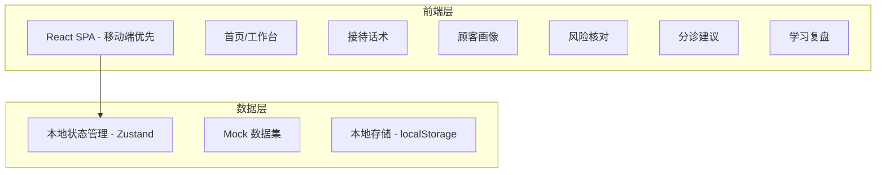
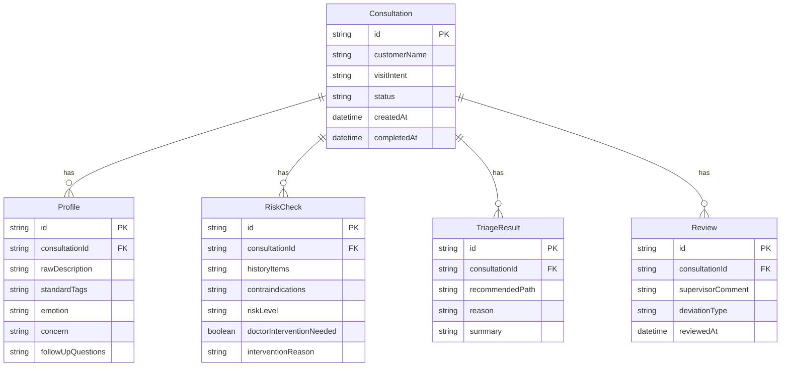

## 1. 架构设计



## 2. 技术说明

- 前端：React@18 + TailwindCSS@3 + Vite
- 初始化工具：Vite
- 状态管理：Zustand（轻量级状态管理）
- 后端：无（纯前端 + Mock 数据）
- 数据库：无（localStorage 持久化 + 内存 Mock 数据）
- 图标：Lucide React
- 动画：Framer Motion
- 图表：Recharts

## 3. 路由定义

| 路由 | 用途 |
|------|------|
| / | 首页/工作台，今日概览与快捷入口 |
| /reception | 接待话术，来意选择与开场问题推荐 |
| /profile | 顾客画像，口语输入整理与情绪记录 |
| /risk | 风险核对，病史追问与禁忌提示 |
| /triage | 分诊建议，路径推荐与面诊摘要生成 |
| /review | 学习复盘，接待记录与偏差分析 |

## 4. 数据模型

### 4.1 数据模型定义



### 4.2 核心数据结构

#### 接待记录（Consultation）
```typescript
interface Consultation {
  id: string
  customerName: string
  visitIntent: string
  status: 'in_progress' | 'completed'
  createdAt: string
  completedAt?: string
}
```

#### 顾客画像（Profile）
```typescript
interface Profile {
  id: string
  consultationId: string
  rawDescription: string
  standardTags: string[]
  emotion: 'anxious' | 'expectant' | 'hesitant' | 'resistant' | 'calm'
  concern: string
  followUpDirections: string[]
}
```

#### 风险核对（RiskCheck）
```typescript
interface RiskCheck {
  id: string
  consultationId: string
  historyChecks: { item: string; checked: boolean }[]
  contraindications: string[]
  riskLevel: 'green' | 'yellow' | 'red'
  doctorInterventionNeeded: boolean
  interventionReason?: string
}
```

#### 分诊结果（TriageResult）
```typescript
interface TriageResult {
  id: string
  consultationId: string
  recommendedPath: 'skin_management' | 'laser' | 'injection' | 'surgery' | 'combined'
  reason: string
  summary: string
}
```

#### 复盘记录（Review）
```typescript
interface Review {
  id: string
  consultationId: string
  supervisorComment?: string
  deviationType?: string
  reviewedAt?: string
}
```
